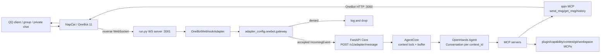

# Tanpopo Current Architecture

This document describes the current runtime after the OpenHands/Core/MCP
refactor. It is intended as the first file to read before changing message flow,
tooling, runtime config, or Docker persistence.

## Project Layout

```text
tanpopo/
  run.py                         # process entry point
  src/
    core/server.py               # FastAPI Core HTTP API
    adapters/events.py           # normalized IncomingEvent contract
    adapters/onebot.py           # OneBot -> IncomingEvent adapter and gateway
    agent/core.py                # OpenHands orchestration, context locks, buffers
    event/__init__.py            # OneBot message parsing
    mcp/                         # built-in MCP servers exposed to the Agent
    runtime/                     # config, registry, logging, MCP normalization
    ws/__init__.py               # OneBot WebSocket client/server wrapper
  .agents/
    skills/                      # reusable Agent instructions
    mcps/                        # runtime-authored MCP plugin home
  .agent_runtime/                # hot runtime registries and overrides
  agent_workspace/               # persisted scratchpad / notes / generated files
  tmp/                           # persisted temporary runtime files
  template/config_template.yaml  # config.yaml template
```

Ignored local files:

- `config.yaml`: local secrets and deployment-specific config.
- `.agent_runtime/history.jsonl`: runtime audit log generated by plugin manager.
- `.agent_runtime/reload_request.json`: reload trigger generated at runtime.
- `agent_workspace/`: Bot scratch and memory workspace.
- `tmp/`: runtime temporary files.

## Runtime Flow



## Event Contract

The current normalized event is `IncomingEvent`:

```json
{
  "context_id": "qq:group:244847198",
  "payload": {
    "type": "message",
    "text": "@糖霜蒲公英 hello",
    "raw": {
      "message_type": "group",
      "group_id": 244847198,
      "user_id": 3061422023,
      "message_id": 123
    }
  }
}
```

`context_id` is the isolation key. For OneBot:

- Group: `qq:group:{group_id}`
- Private: `qq:private:{user_id}`

The agent currently replies through QQ-specific MCP tools using
`payload.raw`. A future platform-neutral envelope can extend this contract with
`source` and `session`, but that is not the active API yet.

## Core And Concurrency

`AgentCore` owns the runtime conversation state:

- One shared OpenHands `Agent` instance.
- One OpenHands `Conversation` per active `context_id`.
- One `ContextState` per active `context_id`.
- A per-context `asyncio.Lock`.
- A per-context buffer for messages that arrive while the context is busy.

Processing behavior:

1. Core receives an `IncomingEvent`.
2. If the context is idle, it starts a context runner task.
3. If the context is busy, it appends the event to that context's buffer.
4. When the current OpenHands turn completes, buffered events are merged into
   the next batch and sent as one prompt.
5. Idle and excess contexts are garbage-collected by TTL/LRU config.

Config keys:

- `agent_config.context.idle_ttl_seconds`
- `agent_config.context.max_active_contexts`
- `agent_config.context.turn_timeout_seconds`

## MCP Capability Model

OpenHands default terminal/file tools are disabled in the runtime path. Agent
capabilities are exposed through MCP servers.

Default MCP registry:

- `qqio`: OneBot send/query tools and JSONL memory helpers.
- `fetch`: webpage fetch via official fetch MCP.
- `workspace`: local shell command runner.
- `capability`: inspect enabled MCPs, skills, and runtime paths.
- `context`: list/close/reset Core contexts.
- `plugin_manager`: add/enable/disable skills and MCPs, update hot config,
  request reload.
- `git_ops`: controlled status/diff/branch/commit/push for self-authored
  skills and MCPs.

`filesystem` is present but disabled by default.

Runtime-authored reusable MCPs should live under:

```text
.agents/mcps/{name}/server.py
```

Register them through `plugin_manager.add_mcp_server`, then call
`request_agent_reload`.

## Self-Evolution Boundaries

The intended self-evolution path is MCP/skill first, source-code second:

1. Write reusable instructions under `.agents/skills`.
2. Write reusable tools under `.agents/mcps`.
3. Register/enable through `plugin_manager`.
4. Request reload.
5. Use `git_ops` to create a non-main branch.
6. Commit only allowed paths.
7. Push the current branch when Git credentials are available.

`git_ops` defaults to allowed roots:

```text
.agents/skills
.agents/mcps
```

It refuses direct push from `main` or `master`.

## Persistence Model

The container should treat mounted paths as durable memory. The following paths
are mounted by Docker Compose:

```text
/tanpopo/config.yaml        -> ./config.yaml
/tanpopo/.git               -> ./.git
/tanpopo/.agents            -> ./.agents
/tanpopo/.agent_runtime     -> ./.agent_runtime
/tanpopo/agent_workspace    -> ./agent_workspace
/tanpopo/host_workspace     -> ${TANPOPO_HOST_WORKSPACE:-./agent_workspace}
/tanpopo/tmp                -> ./tmp
```

Anything written only inside an unmounted container path can disappear after a
container recreate or image rebuild.

Recommended durable locations:

- `.agents/skills`: reusable behavior instructions.
- `.agents/mcps`: reusable tool implementations.
- `.agent_runtime`: hot registry/config state.
- `agent_workspace`: notes, experiments, generated files, long-lived scratch.
- `tmp`: temporary files that may survive restarts but are not strategic memory.

## Configuration Surfaces

Base config:

- `config.yaml`, copied from `template/config_template.yaml`.
- Local and gitignored.
- Holds secrets, OneBot gateway allowlists, LLM endpoint, and base runtime
  settings.

Hot runtime config:

- `.agent_runtime/config.yaml`
- Updated through plugin-manager tools.
- Supports a limited set of hot keys:
  - `llm_auth.api_key`
  - `llm_auth.base_url`
  - `adapter_config.onebot.gateway`
  - `agent_config.context`
  - `agent_config.openhands.model`
  - `agent_config.openhands.system_prompt`
  - `agent_config.openhands.workspace`
  - `agent_config.openhands.debug_trace`
  - `agent_config.openhands.prewarm`
  - `agent_config.openhands.condenser`

MCP and skill registries:

- `.agent_runtime/mcps.yaml`
- `.agent_runtime/skills.yaml`

Reload trigger:

- `.agent_runtime/reload_request.json`
- Generated at runtime and ignored by git.

## Current User-Facing Features

- Receive QQ group/private messages through NapCat OneBot reverse WebSocket.
- Filter inbound messages by allowlist gateway.
- Preserve separate short-term context per QQ group/private session.
- Buffer bursts from the same context and process them as a merged batch.
- Reply to QQ text/image/face-capable contexts through `qqio`.
- Fetch webpages through MCP.
- Inspect and manage runtime capabilities.
- Add/enable/disable skills and MCP servers at runtime.
- Reset stale short-term contexts.
- Maintain simple JSONL memories through `qqio` memory tools.
- Let the Bot write files in persisted workspaces.
- Let the Bot commit/push allowed self-authored skill/MCP changes through
  `git_ops`, when credentials are configured.

## Known Gaps

- The active event contract is `context_id + payload`, not full
  `source/session/payload` envelope routing yet.
- Reply routing is QQ-specific through `payload.raw`; there is no platform-neutral
  `reply_user` MCP yet.
- Process supervision for runtime-authored long-running plugins is not yet
  implemented.
- Long-term memory is JSONL-based, not a vector or structured memory system.
- Source-code self-modification is possible through workspace shell access, but
  `git_ops` intentionally limits the safer default self-evolution path to
  `.agents/skills` and `.agents/mcps`.
